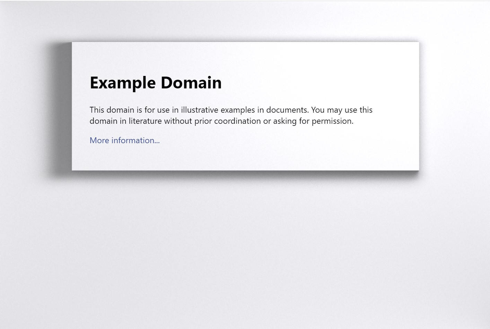

# RTX: ON

Use proper ray traced shadow instead of the boring box-shadow on your web pages.



## Quickstart

Simply add to your web page:

```html
<script type="importmap">
{
  "imports": {
    "rtx-on": "https://rtx-on.steren.fr/rtx-on.js"
  }
}
</script>
<script type="module">
import * as rtx from 'rtx-on';

window.onload = function() {
    rtx.on();
}
</script>
```

See the [examples folder](./examples/) for more examples.

## Local installation

Install the module with `npm install rtx-on`

## API reference

#### `rtx.on({background, raised})`

Turn on the ray traced shadow effect on the provided background elements for the provided raised elements.
Removes any existing box shadow effect.

 * `background` element to apply the effect to, defaults to the entire body.
 * `raised[]` elevated elements, defaults to children of the background element with a box shadow style
 * `disableIfDarkMode`: if `true`, will not apply the effect if the user has dark mode enabled, which dims the light of rtx-on. Defaults to `false`.
 * `forceLightMode`: if `true`, the effect will always apply at full light. Defaults to `false`. Set to `true` if your website does *not* implement dark mode.
 * `moveLightOnClick`: Set to `true` to move the light under the cursor when clicking on the page. Default to false.

Raised elements keep their `border-radius`: a rounded element is rendered as a rounded box, and casts a shadow with rounded corners. The rendered shape has a single radius shared by its four corners, so an element whose corners differ gets their average.

The page is seen from straight above, so a raised element covers exactly the rectangle of the element it stands for, wherever that element sits on the page: being raised neither enlarges it nor turns its sides towards the viewer.

#### `rtx.off()`

Turn off the ray traced shadow effect.
Restores any existing box shadow effect.

#### `rtx.button()`

Display an RTX ON/OFF button on the page. For fun.

## How it works

The page is modelled as a heightfield: a flat background with the raised elements standing on
it, under a single round light hanging above. Its lighting is solved with
[radiance cascades](https://github.com/Raikiri/RadianceCascadesPaper), a technique by
Alexander Sannikov, in a WebGL2 renderer that ships with this module and pulls in no
dependencies.

Radiance cascades solve for the light arriving at every point from every direction at once,
in a hierarchy of probe grids. The bottom level has a probe every few pixels but only four
directions, and each level up quadruples the number of directions while halving the probe
grid on both axes, covering a stretch of ray four times longer. Near the surface, where light
changes quickly from place to place but slowly from direction to direction, the dense bottom
level does the work; far away, where the opposite holds, the sparse top levels do. Merging the
hierarchy back down gives soft shadows that sharpen as they approach whatever casts them, and
light bounced off the sides of raised elements onto the page around them.

The scene does not move, so the renderer solves it in a handful of frames and then stops,
until the page is resized or the light is moved.