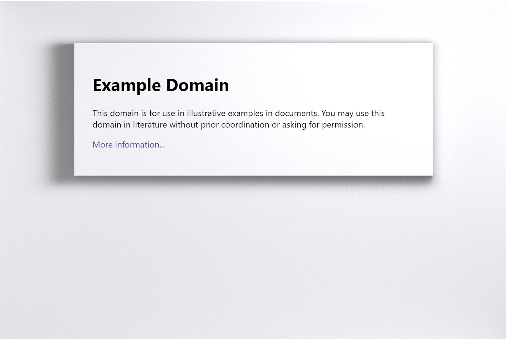

# RTX: ON

Use proper ray traced shadow instead of the boring box-shadow on your web pages.



## Quickstart

Simply add to your web page:

```html
<script type="importmap">
{
  "imports": {
    "webgl-path-tracing": "https://webgl-path-tracing.steren.fr/webgl-path-tracing.js",
    "sylvester": "https://webgl-path-tracing.steren.fr/sylvester.src.js",
    "rtx-on": "https://rtx-on.steren.fr/rtx-on.js"
  }
}
</script>
<script type="module">
import * as rtx from 'rtx-on';

window.onload = function() {
    rtx.on();
}
</script>
```

See the [examples folder](./examples/) for more examples.

## Local installation

Install the module with `npm install rtx-on`

## API reference

#### `rtx.on({background, raised})`

Turn on the ray traced shadow effect on the provided background elements for the provided raised elements.
Removes any existing box shadow effect.

 * `background` element to apply the effect to, defaults to the entire body.
 * `raised[]` elevated elements, defaults to children of the background element with a box shadow style
 * `disableIfDarkMode`: if `true`, will not apply the effect if the user has dark mode enabled. Defaults to `false`.
 * `enableForAllAspectRatio`: At the moment, the effect only applies if the page isn't too wide or high. Set to `true` to force enable the effect on any aspect ratio.

#### `rtx.off()`

Turn off the ray traced shadow effect.
Restores any existing box shadow effect.

#### `rtx.button()`

Display an RTX ON/OFF button on the page. For fun.

## Acknowledgements

This module uses [webgl-path-tracing](https://webgl-path-tracing.steren.fr/), a WebGL path tracing library developed in 2010 by [Evan Wallace](https://madebyevan.com/) and later updated by the author of this module.